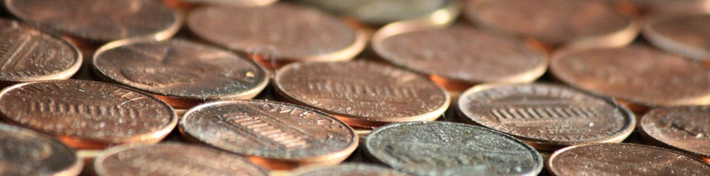

# Will nano-payments save the web?

## TLDR; yes.

At least, once we are able to provide/accommodate them in an easily digestible form. But let's start at the beginning.

## What are nano-payments?

That is the really easy part, it's the ability to do, and to accept really small amounts. To get this thing started I would say \$0.05 and up. But ideally, it starts even lower. After all, the web has a global reach, and there are regions where even 5 cents is a significant amount of money.

Oh, and one thing more. _All transactions are final_. No refunds, no bargaining, nothing. A done deal is a done deal. This is important. Compare it with buying an ice-cream. You can't return the thing. If you drop it, yeah.. bad luck, If it turns out you don't like the taste.. too bad. You can inform the seller, and if there is a good salesperson they might give you something else, but if they don't nobody is surprised.
Why is this important? It protects the seller and takes out a significant part of the cost involved in digital payments. The customer is also protected by this. This is more difficult to explain in a few words so I will come back onto this in a later article. I will address stuff like customer protection and relevant issues in there too.

## Why do we need nano-payments?

_To get the next billion content creators into the web_. There is an enormous potential, that is now completely untapped. Puzzled by this?

### Let me sketch you a few examples:

I know Bob. Bob has created a very artsy notes app. When a new note is created it uses some heuristics to add a nice doodle to it, and the formatting is awesome (well at least he thinks so, and his whole family agrees!) He basically has created it for himself, and for his girlfriend, and he has no interest in creating a startup out of this. He is not a businessman, neither does he want to be.
But he thinks other people might like this thing, and he wants to share it with the world.
However, that involves costs. yeah… well…
Nothing happens evermore.
If there was an easy way for him to charge \$0.05 for every 5 notes his customers create, he might make a few bucks a month, and be able to pay for those costs.

### Now, meet Susan.

Susan is an art student, and she likes to create small interactive doodles. She prefers to build those things with web-tech, because of the low barrier to entrance, and she can host those for free using her GitHub account. Her doodles are wildly popular in a small partition of the tech crowd. She has a few hundred page-views every day, and this seems to be growing slowly.
Still, Susan is struggling making the rent, and her study costs. So, she tried adding ads, but she really disliked what that does to her creations. Also, the payout is.. well.. the tech crown seems to like add-blockers too. 
Nano-payments would enable here to sell "options" to the people interacting with her art.
She had the idea of selling additional color swipes for $0.05, and shape gadismos for $0.10. As she has found out that here visitors ask for those on a regular interval. Also, nano payments would add the ability to easily add a couple of "donate xx" gadismos.
(Yeah, I have no clue what gadismos are…..)

### Then I'm introducing is Nahib.

Nahib is a math wizard and likes to create number puzzles. He has created a small maze-like game where you need to solve those to navigate along. He did build this for the fun of building it, and mostly for his own pleasure. However, he has put it out, and now gets pinged on a regular interval from people that want a hint, or a solution for a puzzle because the got stuck. Nano-payments would mean, he would be able to charge $0.02 for the first hint, $0.03 for the second, and $0.10 cents for the solution. As the math wizard Nahib is, he calculated that with his current user-base he would be able to make $25,- a month. He realized he might be onto something here, and did realize that he could use that to grow his user-base faster, and perhaps in 2 to 3 years he would be able to quit his day job to fully embrace building puzzle games.

### Now welcome Eleanore to the stage

Elanore runs a medium-sized startup. She struggles to make here startup really profitable. Here app is a kind of service that hosts stories, and provides some nice tools for authoring those and do metrics. The full works.
They started off giving out the tool for free, but the original plan (advertising) failed and doesn't pay the bills. Also, the authors didn't like ads. Then she thought, "hey, we provide a subscription to returning readers." Well. that kind of worked. But as it turns out, that people really don't want to be pushed into a subscription. Also opening the link in incognito is really hard to detect. So subscriptions didn't bring the result needed. So, now they want to give out a few less free reads, and then charge $0.10 to read a story and $0.25 for a premium story. The calculations and prognosis for that seem to work out quite nice. The pay as you go system seems to fit her business better and compliments her subscription model.

### What do have Bob, Susan, and Nahib in common?

Well, they all would like to make some money off their creations, but have no interest in running a real business. They mostly want to share their creations, and with a little bit of income/stimulus, they can even create more, better content. Or ease their current situation a bit. But mostly they are passionate about their creations. And they would love if their creations would be seen by a larger audience. If it makes them a decent income, they would be even happier. However, that is for none of them the reason for creating.

### That leaves Elanore,

The entrepreneur she is, she has less of a problem with the business side. She is looking forward to seeing the revenues stream in, from her pay as you go concept. Everybody she talked with seems to be positive on her new payments model. She is already thinking about up-selling, and perhaps even charge a \$0.01 for every "high five" (the "likes" on her system), so she can pay that out to the authors.

### What is their current situation?

Imaginary. Today this is fantasy. They have no way to register for or accept nano payments, as far as I know. This is really holding the web back. Imagine a world where this would be possible.

_The next billion content creators would come out of the woodwork in no time._

It would enable people to make a little bit of money by doing what they like. Also, it would enable somewhat more enterprising people to start a business really easily. Some would be in there for the money, and others would just change small amounts to cover the costs. Heck, it would even enable a couple to get rich quickly. And all of that is a good thing™.

### So, where would we go from here?

yeah… I must to some sort of conclusion here shouldn't I. Thing is I don't know. I have looked into a lot of systems, talked to a couple of providers. Providers like PayPal, and cryptocurrency are not accepted enough to provide a viable solution. (let alone the minimum they accept) A subscription service like Patreon is very nice but starts at $1.00. Also, it is a subscription instead of a 1-off payment. This will not suit real-world applications. With a subscription, you create an expectation that you keep on renewing the stuff. Elanor will, but the others might call it a day after a few iterations, or want to start something new.
Also seem the minimal cost of a transaction to ly around $0.29, sounds like a little bit, but when you want to do nano-transactions that's actually a lot of money.

There is a lot more that can be told about this, but I will do that in a couple of follow-up blogs. In the next one, I will give my take on what I think is needed, why it's needed, and who would be able to provide it. Depending on feedback I can explore each facet of nano-payments a bit deeper, and see what more I need to address.
